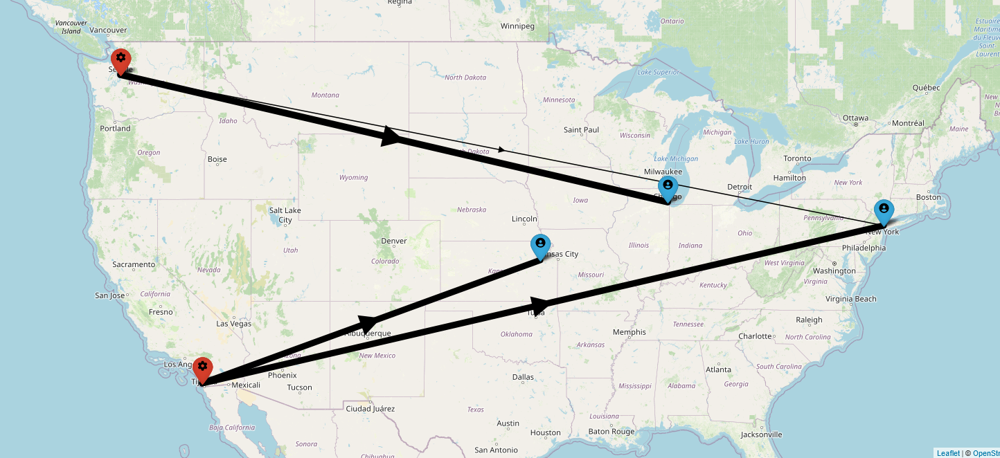

# A Transportation Problem


<p style='text-align: justify;' markdown>
    &emsp;&emsp;This tutorial is an upgrade of the <a href="https://dapensoft.github.io/pyorlib/#a-practical-example" target="_blank">Practical Example</a> 
	from the main page. In this case, we are going to re-implement the transportation problem presented in the 
	<a href="https://www.gams.com/docs/pdf/Tutorial.PDF" target="_blank">GAMS Tutorial</a> by Richard E. Rosenthal 
	using PyORlin's workflow. The purpose of this example is to provide a quick but complete overview of PyORlib and
	its features in a more realistic scenario.
</p>

### Problem Formulation

<p style='text-align: justify;'>
    &emsp;&emsp;The transportation problem we will address is a classic instance of linear programming's transportation
	problem, which has historically served as a testing ground for the development of optimization technology. This 
	transportation problem involves determining the optimal flow of a product from multiple sources (plants) to 
	destinations (markets) to minimize costs while satisfying demands.
</p>

$$
\begin{align}
\text{Minimize:} \quad & \sum_{i=1}^{n} \sum_{j=1}^{m} c_{ij} x_{ij} \\
\\
\text{Subject to:} \quad & \sum_{j=1}^{m} x_{ij} \leq a_{i} \quad \forall_{i} \\
& \sum_{i=1}^{n} x_{ij} \geq b_{j} \quad \forall_{j} \\
& x_{ij} \geq 0 \quad \forall_{ij}, \thinspace integer \\
& i=1,...,n; \quad j=1,...,m \\
\end{align}
$$

<p style='text-align: justify;'>
    &emsp;&emsp;Before diving into the implementation, let's take a moment to familiarize ourselves with the key 
	components of the model. This brief exploration will provide a better understanding of how these components 
	work together.
</p>

- **Indices:**

	&emsp;$i=$ plants; $\quad j=$ markets.

- **Parameters (Given Data):**

	&emsp;$a_{i}=$ supply of commodity of plant $i$ (in cases).

	&emsp;$b_{j}=$ demand for commodity at market $j$ (cases).

	&emsp;$c_{ij}=$ cost per unit shipment between plan $i$ and market $j$ ($/case).

- **Decision Variables:**

	&emsp;$x_{ij}=$ amount of commodity to ship from plant $i$ to market $j$ (cases).

- **Constraints:**

    &emsp;Observe supply limit at plant $i$: $\sum_{j=1}^{m} x_{ij} \leq a_{i} \quad \forall_{i}$

	&emsp;Satisfy demand at market $j$: $\sum_{i=1}^{n} x_{ij} \geq b_{j} \quad \forall_{j}$

<p style='text-align: justify;'>
    &emsp;&emsp;The GAMS tutorial describes a scenario with two canning plants and three markets. It provides sample 
	supply, demand and cost data. We will use this same data to define our model.
</p>

<table align="center">
    <thead>
		<tr>
            <th></th>
            <th>New York</th>
            <th>Chicago</th>
            <th>Topeka</th>
            <th>Supply</th>
        </tr>
    </thead>
    <tbody>
		<tr>
            <td>Seattle</td>
            <td>2.5</td>
            <td>1.7</td>
            <td>1.8</td>
            <td>350</td>
        </tr>
		<tr>
            <td>San Diego</td>
            <td>2.5</td>
            <td>1.8</td>
            <td>1.4</td>
            <td>600</td>
        </tr>
		<tr>
            <td>Demand</td>
            <td>325</td>
            <td>300</td>
            <td>275</td>
            <td></td>
        </tr>
		<tr>
            <td style="text-align: center" colspan="5">
				<a href="https://miro.gams.com/gallery/app_direct/transport/" target="_blank">
					
				</a>
			</td>
        </tr>
    </tbody>
</table>

### Solution Using PyORlib

<p style='text-align: justify;'>
    &emsp;&emsp;To model and solve the problem in Python, we will utilize PyORlib and its integration with CPLEX. 
	However, it's worth noting that you have the flexibility to choose from various supported optimization engine 
	integrations mentioned in the <a href="https://dapensoft.github.io/pyorlib/getting-started/#optional-dependencies" target="_blank">Optional Dependencies</a> 
	section, or even use your own custom implementations.
</p>

<ol style='text-align: justify;'>

<li><b>Required Imports and Dependencies:</b>
Before proceeding, make sure you have PyORlib installed, along with the CPLEX engine integration. Once everything is 
set up, let's import all the necessary components and start building our transportation model:

```Python linenums="1" 
from dataclasses import dataclass
from math import inf

from pyorlib import Model, Engine
from pyorlib.engines.cplex import CplexEngine  # Can be replaced with other integration options.
from pyorlib.enums import ValueType, ParameterType, OptimizationType  # These enums are used for specifying value types, parameter types, and optimization types in PyORlib.
from pyorlib.structures import DimensionDefinition, ParameterDefinition, TermDefinition, MultiValueParameter  # Classes that are used for organizing and defining the structure of the model.
from pyorlib.validators import DimensionField, ParameterField  # Classes that are used for validating the dimensions and parameters of the model.
```
</li>

<li><b>Model Definition:</b>
In order to keep our code organized, readable, and maintainable over time, we will structure variable, parameter, and 
dimension definitions (metadata) in a clean and extensible manner using PyORlib's definition module.

```Python linenums="1" 
class TransportModelDefinition:
    """Transportation Nomenclature Definitions"""

    @dataclass(frozen=True)
    class Dimensions:
        n = DimensionDefinition(name="n", display_name="Total plants")
        m = DimensionDefinition(name="m", display_name="Total markets")

    @dataclass(frozen=True)
    class Parameters:
        a_i = ParameterDefinition(
            set_name="a_i",
            name=lambda i: f"a_{i}",
            display_name="Supply of commodity of plant i (in cases)",
            parameter_types={ParameterType.FIXED},
            value_types={ValueType.INTEGER},
            min=0,
        )
        b_j = ParameterDefinition(
            set_name="b_j",
            name=lambda j: f"b_{j}",
            display_name="Demand for commodity at market j (cases)",
            parameter_types={ParameterType.FIXED},
            value_types={ValueType.INTEGER},
            min=0,
        )
        c_i_j = ParameterDefinition(
            set_name="c_i_j",
            name=lambda i, j: f"c_{i}_{j}",
            display_name="Cost per unit shipment between plan i and market j ($/case)",
            parameter_types={ParameterType.FIXED},
            value_types={ValueType.CONTINUOUS},
            min=0,
        )

    @dataclass(frozen=True)
    class DecisionVariables:
        x_i_j = TermDefinition(
            set_name="x_i_j",
            name=lambda i, j: f"x_{i}_{j}",
            display_name="Amount of commodity to ship from plant i to market j (cases)",
        )
```
</li>

<li><b>Data Schema and Validations:</b>
Now that we have defined the model components, we can focus on handling data entry and validations for parameters and
dimensions. For this task, we will use PyORlib's structures and validators.

```Python linenums="1" 
@dataclass
class TransportModelSchema:
    """Data Entry Validations"""

    n: int = DimensionField(min=TransportModelDefinition.Dimensions.n.min)
    m: int = DimensionField(min=TransportModelDefinition.Dimensions.m.min)

    a_i: MultiValueParameter = ParameterField(
        parameter_types=TransportModelDefinition.Parameters.a_i.parameter_types,
        value_types=TransportModelDefinition.Parameters.a_i.value_types,
        min=TransportModelDefinition.Parameters.a_i.min,
    )
    b_j: MultiValueParameter = ParameterField(
        parameter_types=TransportModelDefinition.Parameters.b_j.parameter_types,
        value_types=TransportModelDefinition.Parameters.b_j.value_types,
        min=TransportModelDefinition.Parameters.b_j.min,
    )
    c_i_j: MultiValueParameter = ParameterField(
        parameter_types=TransportModelDefinition.Parameters.c_i_j.parameter_types,
        value_types=TransportModelDefinition.Parameters.c_i_j.value_types,
        min=TransportModelDefinition.Parameters.c_i_j.min,
    )

    def __post_init__(self):
        if len(self.a_i.values) != self.n:
            raise ValueError(f"'a_i' values must have a length of {self.n}")
        if len(self.b_j.values) != self.m:
            raise ValueError(f"'b_j' values must have a length of {self.m}")
        if len(self.c_i_j.values) != self.n * self.m:
            raise ValueError(f"'c_i_j' values must have a length of {self.n * self.m}")
```
</li>

<li><b>Transportation Model:</b>
With the data entry schema in place, we can now define the transportation model.

```Python linenums="1" hl_lines="9 16 48 62 71 80"
class TransportModel(Model):

    def __init__(self, engine: Engine, data: TransportModelSchema, debug: bool = False):
        super().__init__(engine=engine, name="Transportation Model", debug=debug)

        if data is None:
            raise ValueError("'data' parameter cannot be None.")

        # Dimensions
        n = self.add_dimension(name=TransportModelDefinition.Dimensions.n.name, value=data.n)
        m = self.add_dimension(name=TransportModelDefinition.Dimensions.m.name, value=data.m)

        n_range = range(1, n + 1)
        m_range = range(1, m + 1)

        # Parameters
        for i in n_range:  # Plant's supply values
            self.add_constant_to_set(
                set_name=TransportModelDefinition.Parameters.a_i.set_name,
                set_index=(i,),
                const_name=TransportModelDefinition.Parameters.a_i.name(i),
                value_type=data.a_i.value_type,
                value=data.a_i.values[i - 1],
            )
        a_i = self.get_term_set_by_name(name=TransportModelDefinition.Parameters.a_i.set_name)

        for j in m_range:  # Market's demands
            self.add_constant_to_set(
                set_name=TransportModelDefinition.Parameters.b_j.set_name,
                set_index=(j,),
                const_name=TransportModelDefinition.Parameters.b_j.name(j),
                value_type=data.b_j.value_type,
                value=data.b_j.values[j - 1],
            )
        b_j = self.get_term_set_by_name(name=TransportModelDefinition.Parameters.b_j.set_name)

        for i in n_range:
            for j in m_range:  # Costs
                self.add_constant_to_set(
                    set_name=TransportModelDefinition.Parameters.c_i_j.set_name,
                    set_index=(i, j),
                    const_name=TransportModelDefinition.Parameters.c_i_j.name(i, j),
                    value_type=data.c_i_j.value_type,
                    value=data.c_i_j.values[(i - 1) * m + (j - 1)],
                )
        c_i_j = self.get_term_set_by_name(name=TransportModelDefinition.Parameters.c_i_j.set_name)

        # Decision variables
        for i in n_range:
            for j in m_range:
                self.add_variable_to_set(
                    set_name=TransportModelDefinition.DecisionVariables.x_i_j.set_name,
                    set_index=(i, j),
                    var_name=TransportModelDefinition.DecisionVariables.x_i_j.name(i, j),
                    value_type=ValueType.INTEGER,
                    lower_bound=0,
                    upper_bound=inf,
                )
        x_i_j = self.get_term_set_by_name(name=TransportModelDefinition.DecisionVariables.x_i_j.set_name)

        
        # Supply limit at plants constraints
        for i in n_range:
            self.add_constraint(
                expression=sum(
                    x_i_j[i, j]
                    for j in m_range
                ) <= a_i[(i,)]
            )

        # Satisfy demand at markets constraints
        for j in m_range:
            self.add_constraint(
                expression=sum(
                    x_i_j[i, j]
                    for i in n_range
                ) >= b_j[(j,)]
            )

        # Objective function
        self.set_objective(
            opt_type=OptimizationType.MINIMIZE,
            expression=sum(
                c_i_j[i, j] * x_i_j[i, j]
                for i in n_range
                for j in m_range
            )
        )
```
</li>

<li><b>Model Optimization:</b>
Finally, having defined the transportation model class, we can create a new instance of it with our data and 
optimize it.

```Python linenums="1" 
# Instantiate the transportation model
model = TransportModel(
    engine=CplexEngine(),
    data=TransportModelSchema(
        n=2,
        m=3,
        a_i=MultiValueParameter(
            parameter_type=ParameterType.FIXED,
            value_type=ValueType.INTEGER,
            values=(350, 600),
        ),
        b_j=MultiValueParameter(
            parameter_type=ParameterType.FIXED,
            value_type=ValueType.INTEGER,
            values=(325, 300, 275),
        ),
        c_i_j=MultiValueParameter(
            parameter_type=ParameterType.FIXED,
            value_type=ValueType.CONTINUOUS,
            values=(2.5, 1.7, 1.8, 2.5, 1.8, 1.4),
        ),
    )
)

# Optimize the model
model.solve()

# Display solution
model.print_solution()
```

<details markdown="1" class="quote">
<summary>Click here to view the complete code...</summary>

```Python linenums="1" 
from dataclasses import dataclass
from math import inf

from pyorlib import Model, Engine
from pyorlib.engines.cplex import CplexEngine  # Can be replaced with other integration options.
from pyorlib.enums import ValueType, ParameterType, OptimizationType  # These enums are used for specifying value types, parameter types, and optimization types in PyORlib.
from pyorlib.structures import DimensionDefinition, ParameterDefinition, TermDefinition, MultiValueParameter  # Classes that are used for organizing and defining the structure of the model.
from pyorlib.validators import DimensionField, ParameterField  # Classes that are used for validating the dimensions and parameters of the model.


class TransportModelDefinition:
    """Transportation Nomenclature Definitions"""

    @dataclass(frozen=True)
    class Dimensions:
        n = DimensionDefinition(name="n", display_name="Total plants")
        m = DimensionDefinition(name="m", display_name="Total markets")

    @dataclass(frozen=True)
    class Parameters:
        a_i = ParameterDefinition(
            set_name="a_i",
            name=lambda i: f"a_{i}",
            display_name="Supply of commodity of plant i (in cases)",
            parameter_types={ParameterType.FIXED},
            value_types={ValueType.INTEGER},
            min=0,
        )
        b_j = ParameterDefinition(
            set_name="b_j",
            name=lambda j: f"b_{j}",
            display_name="Demand for commodity at market j (cases)",
            parameter_types={ParameterType.FIXED},
            value_types={ValueType.INTEGER},
            min=0,
        )
        c_i_j = ParameterDefinition(
            set_name="c_i_j",
            name=lambda i, j: f"c_{i}_{j}",
            display_name="Cost per unit shipment between plan i and market j ($/case)",
            parameter_types={ParameterType.FIXED},
            value_types={ValueType.CONTINUOUS},
            min=0,
        )

    @dataclass(frozen=True)
    class DecisionVariables:
        x_i_j = TermDefinition(
            set_name="x_i_j",
            name=lambda i, j: f"x_{i}_{j}",
            display_name="Amount of commodity to ship from plant i to market j (cases)",
        )


@dataclass
class TransportModelSchema:
    """Data Entry Validations"""

    n: int = DimensionField(min=TransportModelDefinition.Dimensions.n.min)
    m: int = DimensionField(min=TransportModelDefinition.Dimensions.m.min)

    a_i: MultiValueParameter = ParameterField(
        parameter_types=TransportModelDefinition.Parameters.a_i.parameter_types,
        value_types=TransportModelDefinition.Parameters.a_i.value_types,
        min=TransportModelDefinition.Parameters.a_i.min,
    )
    b_j: MultiValueParameter = ParameterField(
        parameter_types=TransportModelDefinition.Parameters.b_j.parameter_types,
        value_types=TransportModelDefinition.Parameters.b_j.value_types,
        min=TransportModelDefinition.Parameters.b_j.min,
    )
    c_i_j: MultiValueParameter = ParameterField(
        parameter_types=TransportModelDefinition.Parameters.c_i_j.parameter_types,
        value_types=TransportModelDefinition.Parameters.c_i_j.value_types,
        min=TransportModelDefinition.Parameters.c_i_j.min,
    )

    def __post_init__(self):
        if len(self.a_i.values) != self.n:
            raise ValueError(f"'a_i' values must have a length of {self.n}")
        if len(self.b_j.values) != self.m:
            raise ValueError(f"'b_j' values must have a length of {self.m}")
        if len(self.c_i_j.values) != self.n * self.m:
            raise ValueError(f"'c_i_j' values must have a length of {self.n * self.m}")


class TransportModel(Model):

    def __init__(self, engine: Engine, data: TransportModelSchema, debug: bool = False):
        super().__init__(engine=engine, name="Transportation Model", debug=debug)

        if data is None:
            raise ValueError("'data' parameter cannot be None.")

        # Dimensions
        n = self.add_dimension(name=TransportModelDefinition.Dimensions.n.name, value=data.n)
        m = self.add_dimension(name=TransportModelDefinition.Dimensions.m.name, value=data.m)

        n_range = range(1, n + 1)
        m_range = range(1, m + 1)

        # Parameters
        for i in n_range:  # Plant's supply values
            self.add_constant_to_set(
                set_name=TransportModelDefinition.Parameters.a_i.set_name,
                set_index=(i,),
                const_name=TransportModelDefinition.Parameters.a_i.name(i),
                value_type=data.a_i.value_type,
                value=data.a_i.values[i - 1],
            )
        a_i = self.get_term_set_by_name(name=TransportModelDefinition.Parameters.a_i.set_name)

        for j in m_range:  # Market's demands
            self.add_constant_to_set(
                set_name=TransportModelDefinition.Parameters.b_j.set_name,
                set_index=(j,),
                const_name=TransportModelDefinition.Parameters.b_j.name(j),
                value_type=data.b_j.value_type,
                value=data.b_j.values[j - 1],
            )
        b_j = self.get_term_set_by_name(name=TransportModelDefinition.Parameters.b_j.set_name)

        for i in n_range:
            for j in m_range:  # Costs
                self.add_constant_to_set(
                    set_name=TransportModelDefinition.Parameters.c_i_j.set_name,
                    set_index=(i, j),
                    const_name=TransportModelDefinition.Parameters.c_i_j.name(i, j),
                    value_type=data.c_i_j.value_type,
                    value=data.c_i_j.values[(i - 1) * m + (j - 1)],
                )
        c_i_j = self.get_term_set_by_name(name=TransportModelDefinition.Parameters.c_i_j.set_name)

        # Decision variables
        for i in n_range:
            for j in m_range:
                self.add_variable_to_set(
                    set_name=TransportModelDefinition.DecisionVariables.x_i_j.set_name,
                    set_index=(i, j),
                    var_name=TransportModelDefinition.DecisionVariables.x_i_j.name(i, j),
                    value_type=ValueType.INTEGER,
                    lower_bound=0,
                    upper_bound=inf,
                )
        x_i_j = self.get_term_set_by_name(name=TransportModelDefinition.DecisionVariables.x_i_j.set_name)

        
        # Supply limit at plants constraints
        for i in n_range:
            self.add_constraint(
                expression=sum(
                    x_i_j[i, j]
                    for j in m_range
                ) <= a_i[(i,)]
            )

        # Satisfy demand at markets constraints
        for j in m_range:
            self.add_constraint(
                expression=sum(
                    x_i_j[i, j]
                    for i in n_range
                ) >= b_j[(j,)]
            )

        # Objective function
        self.set_objective(
            opt_type=OptimizationType.MINIMIZE,
            expression=sum(
                c_i_j[i, j] * x_i_j[i, j]
                for i in n_range
                for j in m_range
            )
        )


# Instantiate the transportation model
model = TransportModel(
    engine=CplexEngine(),
    data=TransportModelSchema(
        n=2,
        m=3,
        a_i=MultiValueParameter(
            parameter_type=ParameterType.FIXED,
            value_type=ValueType.INTEGER,
            values=(350, 600),
        ),
        b_j=MultiValueParameter(
            parameter_type=ParameterType.FIXED,
            value_type=ValueType.INTEGER,
            values=(325, 300, 275),
        ),
        c_i_j=MultiValueParameter(
            parameter_type=ParameterType.FIXED,
            value_type=ValueType.CONTINUOUS,
            values=(2.5, 1.7, 1.8, 2.5, 1.8, 1.4),
        ),
    )
)

# Optimize the model
model.solve()

# Display solution
model.print_solution()
```
</details>

<p style='text-align: justify;'>
    &emsp;&emsp;Once you have implemented and solved the model using PyORlib, you will find the solution outputs 
	displayed in the console logs as follows:
</p>

```console
------ MODEL SOLUTION ------

Objective function:
        Status: OPTIMAL
        Value:  1707.5
Terms:
        Name: x_1_1 | Type: Variable | Value type: Integer | lb: 0 | ub: inf | val: 50  
        Name: x_1_2 | Type: Variable | Value type: Integer | lb: 0 | ub: inf | val: 300  
        Name: x_2_1 | Type: Variable | Value type: Integer | lb: 0 | ub: inf | val: 275  
        Name: x_2_3 | Type: Variable | Value type: Integer | lb: 0 | ub: inf | val: 275  
```
</li>

</ol>

### Recap

<p style='text-align: justify;'>
    &emsp;&emsp;In this tutorial, we explored how to use the PyORlib library to optimize a transportation problem—an 
	upgrade from the practical example covered earlier. Throughout our journey, we gained hands-on experience applying
	PyORlib's powerful features to model and solve a real-world optimization challenge of transporting products between
	multiple sources and destinations.
</p>

<p style='text-align: justify;'>
    &emsp;&emsp;Firstly, we introduced the transportation problem and defined the sources, destinations, costs and 
	demands. By structuring our model with PyORlib's definition module classes, we created an organized and readable 
	representation of the transportation model. We also handled data entries and ensured valid input using PyORlib's 
	data structures and validators.
</p>

<p style='text-align: justify;'>
    &emsp;&emsp;With our transportation model built, we then optimized it using PyORlib's techniques to find the 
	lowest-cost flows that meet all demands. The console outputs displayed the solution, providing valuable insights.
	Overall, PyORlib proved to be a flexible and effective tool for tackling this classic optimization problem.
</p>

<p style='text-align: justify;'>
    &emsp;&emsp;In summary, this tutorial equipped us with the skills to leverage PyORlib's full capabilities for a 
	variety of optimization challenges. Armed with our newfound knowledge of modeling, data processing, and 
	optimization, we can now unlock the potential for impactful Python projects across many domains.
</p>
