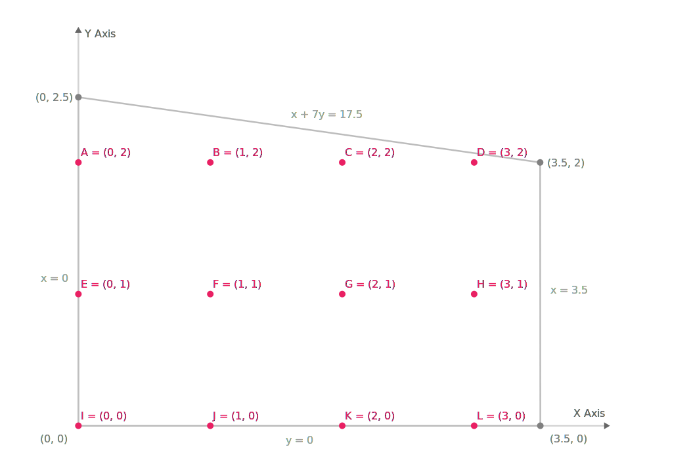

---
hide:
  - navigation
---

<style>
    .md-content .md-content__inner.md-typeset h1 { height: 0; margin: 0; color: transparent; }
    .md-content .md-content__inner.md-typeset::before { height: 0; } 
</style>

<br>

<p align="center">
   
</p>

<br>

---

**Documentation**: <a href="https://dapensoft.github.io/pyorlib" target="_blank">https://dapensoft.github.io/pyorlib</a>

**Source Code**: <a href="https://github.com/dapensoft/pyorlib" target="_blank">https://github.com/dapensoft/pyorlib</a>

---

<p style='text-align: justify;' markdown>
    &emsp;&emsp;PyORlib is a powerful Python library for operations research and optimization. It provides a set of 
    abstractions to easily define, solve, and interact with mathematical models in a standardized manner across 
    different optimization packages. With PyORlib, you can easily implement mathematical models using a user-friendly 
    interface, while seamlessly identifying the ideal solver or optimization package, such as CPLEX, Gurobi, 
    OR-Tools, or PuLP, that perfectly aligns with your specific requirements.
</p>

## Key Features

<p style='text-align: justify;'>
    PyORlib offers a powerful yet easy-to-use set of tools for mathematical modeling and optimization:
</p> 

<ul style='text-align: justify;'>

<li><b>Intuitive API</b> ─ 
PyORlib provides a user-friendly API that allows you to define, solve, and interact with mathematical models in a 
standardized manner across different optimization packages.
</li>

<li><b>Seamless Solver Integration</b> ─ 
Optimize models across different solvers, including custom ones, without modifying the model's definition. Tailor the 
behavior and capabilities of the solvers to perfectly align with your unique requirements.
</li>

<li><b>Simplified Mathematical Modeling</b> ─ 
Define mathematical models effortlessly using PyORlib's comprehensive set of abstractions and classes. Focus on the 
problem at hand instead of getting lost in implementation details.
</li>

<li><b>Scalability and Maintainability</b> ─ 
Keep your code organized, readable, and maintainable over time with the PyORlib's workflow. Structure your variables,
parameters, constraints, and objective functions in a clean and extensible manner.
</li>

<li><b>No Overhead</b> ─ 
PyORlib ensures full compatibility between models and different solvers by seamlessly translating models to each 
solver's native format, acting as a standardized communication interface.
</li>

<li><b>Data Validation</b> ─ 
PyORlib offers comprehensive format and content validations to ensure the integrity of your model data. These 
validation features help identify errors early and maintain consistent, error-free model data for robust optimization.
</li>

<li><b>Comprehensive Documentation</b> ─ 
PyORlib provides a comprehensive documentation suite that includes API references and usage examples, to effectively
leverage all the features and capabilities of the library.
</li>

</ul>

## Simple Example
???+ Warning

    The following example has been taken from an example posted on the official OR-Tools website. The purpose is to demonstrate how this problem can be solved using OR-Tools and PyORlib. You can find the original example at the following link: [MIP Example](https://developers.google.com/optimization/mip/mip_example)

&emsp;&emsp;For this example, we are going to solve a simple problem where the objective is to find the highest integer coordinates (x, y) for Y Axis inside a defined shape. In the following image, we can appreciate the shape, which is composed of four segments, and the plausible values that we need to search for are shown as the pink dots.

<p align="center">
   
</p>

### Defining an optimization model
&emsp;&emsp;First, we need to define an optimization model that allows us to maximize the values of y and x while satisfying the given constraints. In this particular case, the model that achieves the desired goal is represented as follows:

$$
\begin{align}
\text{Maximize:} \quad & x + 10y \\
\text{Subject to:} \quad & x + 7y = 17.5 \\
& 0 \leq x \leq 3.5 \\
& 0 \leq y \leq 2.5 \\
\end{align}
$$

### Implementing the model in code
&emsp;&emsp;Next, we need to translate the optimization model into code. For that, we are going to use the PyORlib to define a function that builds our model using a given engine which wraps an optimization suite:

=== "Using `Model` class"
    ``` py title="Implementing the model in code" linenums="1"
    from math import inf
    from typing import Tuple, Dict
    
    from pyorlib.core.loggers import StdOutLogger
    from pyorlib.mp import Model, ValueType, OptimizationType
    from pyorlib.mp.algebra import Variable, Term
    from pyorlib.mp.engines import Engine
    from pyorlib.mp.engines.cplex import CplexEngine
    from pyorlib.mp.engines.gurobi import GurobiEngine
    from pyorlib.mp.engines.ortools import ORToolsEngine

    def create_optimization_model(engine: Engine) -> Model:
        # Create an optimization model
        model = Model(name="Optimization model", engine=engine)  # (1)!

        # Create x variable
        x: Variable = model.add_variable(name="x", value_type=ValueType.INTEGER, lower_bound=0, upper_bound=inf)
        # Create y variable
        y: Variable = model.add_variable(name="y", value_type=ValueType.INTEGER)  # (2)!

        # Add model constraints
        # Constraint 1: 0 <= x <= 3.5 (3)
        model.add_constraint(expression=0 <= x)
        model.add_constraint(expression=x <= 3.5)  # (4)!
        # Constraint 2: 0 <= y <= 2.5
        model.add_constraint(expression=0 <= y)
        model.add_constraint(expression=y <= 2.5)
        # Constraint 3: x + 7*y = 17.5
        model.add_constraint(expression=x + 7 * y <= 17.5)

        # Define the objetive function
        model.set_objective(opt_type=OptimizationType.MAXIMIZE, expression=x + 10 * y)

        # Return model
        return model
    ```

    1. In this case, we are using the `Model` class to define the model. This class provides some tools over the `Engine` to manage large models in a defined way.
    2. By default, all variables, whether they are integers or continuous, are defined between `[0, +inf)`. Binary variables can only be 0 or 1.
    3. Some optimization packages do not support expressions like `0 <= x <= 3.5`, and we recommend splitting them into two separate constraints, which does not affect the performance of the model optimization.
    4. These constraints can be avoided since the `lower_bound` and `upper_bound` parameters at variable creation can help you define the bounds of your variables.

=== "Using `Engine` class"
    ``` py title="Implementing the model in code" linenums="1"
    from math import inf
    from typing import Tuple, Dict
    
    from pyorlib.core.loggers import StdOutLogger
    from pyorlib.mp import Model, ValueType, OptimizationType
    from pyorlib.mp.algebra import Variable, Term
    from pyorlib.mp.engines import Engine
    from pyorlib.mp.engines.cplex import CplexEngine
    from pyorlib.mp.engines.gurobi import GurobiEngine
    from pyorlib.mp.engines.ortools import ORToolsEngine

    def create_optimization_model(engine: Engine) -> Tuple[Engine, Dict[str, Term]]:
        # No need to create a model (1)

        # Create x variable
        x: Variable = engine.add_variable(name="x", value_type=ValueType.INTEGER, lower_bound=0, upper_bound=inf)
        # Create y variable
        y: Variable = engine.add_variable(name="y", value_type=ValueType.INTEGER)  # (2)!

        # Add model constraints
        # Constraint 1: 0 <= x <= 3.5 (3)
        engine.add_constraint(expression=0 <= x)
        engine.add_constraint(expression=x <= 3.5)  # (4)!
        # Constraint 2: 0 <= y <= 2.5
        engine.add_constraint(expression=0 <= y)
        engine.add_constraint(expression=y <= 2.5)
        # Constraint 3: x + 7*y = 17.5
        engine.add_constraint(expression=x + 7 * y <= 17.5)

        # Define the objetive function
        engine.set_objective(opt_type=OptimizationType.MAXIMIZE, expression=x + 10 * y)

        # Return model and list of variables
        return engine, {"x": x, "y": y} # (5)!
    ```

    1. In this case, we are using the `Engine` class to define the model. This class provides a simpler interface over the `Model` interface, which allows you to define your own model structure.
    2. By default, all variables, whether they are integers or continuous, are defined between `[0, +inf)`. Binary variables can only be 0 or 1.
    3. Some optimization packages do not support expressions like `0 <= x <= 3.5`, and we recommend splitting them into two separate constraints, which does not affect the performance of the model optimization.
    4. These constraints can be avoided since the `lower_bound` and `upper_bound` parameters at variable creation can help you define the bounds of your variables.
    5. We need to return the variables and a dictionary with them, in order to ask for their value latter when the model is already solve.

### Solving the model using an optimization suite

???+ Danger

    It's important to note that each optimization package has built-in support for various solvers. Depending on the specific needs of your problem, it may be necessary to specify the desired solver explicitly and not rely on the default solver provided by the `Engine` class.

&emsp;&emsp;PyORlib allows you to use different optimization suites as engines to build and solve your model without the need to rewrite the code for each one. In this case, we are going to use `OR-Tools`, `CPlex`, and `Gurobi` to solve and report the solutions. To do that, you need to create a `main.py` file and add the following lines of code:

=== "Using `Model` class"
    ``` py title="Solving the model" linenums="24"
    if __name__ == "__main__":
        # Get engine classes
        engines_cls = [ORToolsEngine, GurobiEngine, CplexEngine] # (1)!

        # For each class, get an instance and solve the model.
        for cls in engines_cls:
            engine = cls() # (2)!

            # Create the model
            model = create_optimization_model(engine) # (3)!

            # Solve the model
            model.solve()

            # Get model variables
            x: Term = model.get_term_by_name("x") # (4)!
            y: Term = model.get_term_by_name("y")

            # Get solution summary
            print(f"Interface: {type(engine).__name__}")
            print(f"Variables: x:{x.value}, y:{y.value}")
            print(f"Objective function value: {engine.objective_value} with status {engine.solution_status.name}\n")
    ```

    1. `engines_cls` contains a list with the classes of the engines that are going to be used.
    2. By default, PyORlib chooses a default solver without any parameters to solve the model. However, please be aware that in some cases, you may need to pre-create the solver using your desired interface and pass it as an argument to the engine. This is also useful when some extra configuration is needed.
    3. Use the previously defined method `create_optimization_model()` to build the model.
    4. Retrieve the variables from the model by their names. Keep in mind that `get_term_by_name()` returns individual terms by name, and there are other methods to work with sets that have a defined shape (e.g. x_i_j) like `add_variable_to_set()`.

=== "Using `Engine` class"
    ``` py title="Solving the model" linenums="25"
    if __name__ == "__main__":
        # Get engine classes
        engines_cls = [ORToolsEngine, GurobiEngine, CplexEngine] # (1)!

        # For each class, get an instance and solve the model.
        for cls in engines_cls:
            engine = cls() # (2)!

            # Create the model
            engine, variables = create_optimization_model(engine) # (3)!

            # Solve the model
            engine.solve()

            # Get model variables
            x: Term = variables.get("x") # (4)!
            y: Term = variables.get("y")

            # Get solution summary
            print(f"Interface: {type(engine).__name__}")
            print(f"Variables: x:{x.value}, y:{y.value}")
            print(f"Objective function value: {engine.objective_value} with status {engine.solution_status.name}\n")
    ```

    1. `engines_cls` contains a list with the classes of the engines that are going to be used.
    2. By default, PyORlib chooses a default solver without any parameters to solve the model. However, please be aware that in some cases, you may need to pre-create the solver using your desired interface and pass it as an argument to the engine. This is also useful when some extra configuration is needed.
    3. Use the previously defined method `create_optimization_model()` to build the model.
    4. Retrieve the variables from the dictionary that was returned with the engine.

&emsp;&emsp;Finally, the result obtained from the execution of the models (depending on the optimization package used) is that the point D=(3,2) is the highest integer y point with the highest integer x point inside the defined shape.

=== "Using `Model` class"
    ``` text title="Console output"
        Interface: ORToolsEngine
        Variables: x:3.0, y:2.0
        Objective function value: 23.0 with status OPTIMAL

        Interface: GurobiEngine
        Variables: x:3.0, y:2.0
        Objective function value: 23.0 with status OPTIMAL

        Interface: CplexEngine
        Variables: x:3.0, y:2.0
        Objective function value: 23.0 with status OPTIMAL
    ```
=== "Using `Engine` class"
    ``` text title="Console output"
        Interface: ORToolsEngine
        Variables: x:3.0, y:2.0
        Objective function value: 23.0 with status OPTIMAL

        Interface: GurobiEngine
        Variables: x:3.0, y:2.0
        Objective function value: 23.0 with status OPTIMAL

        Interface: CplexEngine
        Variables: x:3.0, y:2.0
        Objective function value: 23.0 with status OPTIMAL
    ```
As we can see, we obtained the desired result on each solver without the need to remake any portion of the code.

## Continuous Evolution
&emsp;&emsp;PyORlib continuously adapts to support developers across various technological and programming domains. Its primary goal is to remain a useful tool for learning about operations research, mathematical model optimization, and testing different optimization packages. While future development may introduce some changes to enhance and expand certain characteristics of the current functionality, we don't anticipate any significant changes that would fundamentally alter the nature of the library.

<details markdown="1" class="info" open>
<summary>Driving Innovation Through Collaboration</summary>

<p style='text-align: justify;'>
    PyORlib is an open source project that welcomes community involvement. If you wish to contribute
	additional optimization suites, improvements, or bug fixes, please check the <a href="/pyorlib/contributing/">Contributing</a> section for guidelines on collaborating.
</p>
</details>

## Get Started Today!

<p style='text-align: justify;' markdown>
    &emsp;&emsp;Are you ready to get started with mathematical modeling and optimization using PyORlib? Follow these 
    steps to integrate PyORlib into your project and start leveraging its powerful modeling tools. Click the button
    below to navigate to the PyORlib Getting Started page and explore detailed instructions, examples, and more:
</p>

---

<p style='text-align: center;' markdown>
    [:material-star-outline:&emsp;Getting Started&emsp;:material-star-outline:](/pyorlib/getting-started/){ .md-button }
</p>

---

## License

<p style='text-align: justify;' markdown>
    &emsp;&emsp;PyORlib is distributed as open source software and is released under the <a href="https://choosealicense.com/licenses/mit/" target="_blank">MIT License</a>. 
    You can view the full text of the license in the <a href="https://github.com/dapensoft/pyorlib/blob/master/LICENSE" target="_blank"><code>LICENSE</code></a> 
    file located in the PyORlib repository.
</p>

